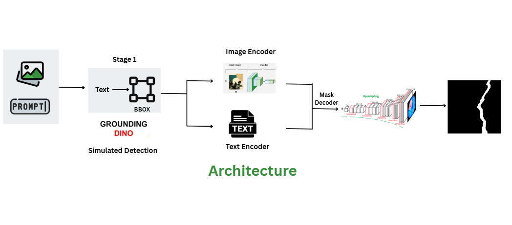

# Prompt-Based Segmentation for Crack and Drywall Joint Detection

A comprehensive implementation of text-conditioned image segmentation models for construction/infrastructure inspection. Given an image and a natural-language prompt, the system produces accurate binary masks for:
- **"segment crack"** (Dataset 2: Cracks)
- **"segment taping area"** (Dataset 1: Drywall-Join-Detect)

## 📋 Table of Contents

- [Overview](#overview)
- [Project Goal](#project-goal)
- [Project Structure](#project-structure)
- [Approaches](#approaches)
- [Requirements](#requirements)
- [Installation](#installation)
- [Dataset](#dataset)
- [Usage](#usage)
  - [CLIPSeg Fine-tuning](#clipseg-fine-tuning)
  - [SAM Fine-tuning](#sam-fine-tuning)
  - [Two-Stage Pipeline](#two-stage-pipeline)
- [Model Performance](#model-performance)
- [Results](#results)
- [Key Features](#key-features)
- [Troubleshooting](#troubleshooting)
- [Citation](#citation)
- [License](#license)

## 🎯 Overview

This project implements multiple state-of-the-art approaches to text-conditioned segmentation for automated infrastructure inspection. The system can identify and segment cracks and drywall taping areas from images using natural language prompts, making it accessible to non-technical users.

### Architecture Overview


*Figure 1: SAM (Segment Anything Model) Architecture used in our fine-tuning approach*

## 🎯 Project Goal

**Primary Objective**: Train (or fine-tune) text-conditioned segmentation models that, given:
- An **image** (construction/building inspection photo)
- A **natural-language prompt** (e.g., "segment crack" or "segment taping area")

Produce an accurate **binary mask** for the requested object.

**Use Cases**:
- Construction quality control
- Building inspection automation
- Damage assessment
- Maintenance planning

## 📁 Project Structure

```
Prompt-Based-Segmentation/
│
├── ClipSeg-Finetune/           # Approach 1: CLIPSeg fine-tuning
│   ├── finetune-sam (1).ipynb  # Fine-tuning notebook
│   └── README.md                # Detailed documentation
│
├── SAM-FineTuned/               # Approach 2: SAM fine-tuning (3 phases)
│   ├── Phase1.ipynb             # Data loading & mask generation
│   ├── Phase2.ipynb             # Data augmentation & preparation
│   └── Phase 3.ipynb            # SAM fine-tuning & evaluation
│
├── TwoStagedPipeline/           # Approach 3: YOLOv8 + SAM pipeline
│   └── TwoStagePipeline.ipynb   # Complete two-stage implementation
│
└── README.md                    # This file
```

## 🚀 Approaches

This project implements **three different approaches** to text-conditioned segmentation:

### 1. **CLIPSeg Fine-tuning** (Single-Stage)
- **Model**: CLIPSeg (CLIP + Dense Prediction)
- **Approach**: Direct text-to-segmentation in one model
- **Pros**: End-to-end, simple deployment
- **Cons**: Requires significant training data
- **Location**: `ClipSeg-Finetune/`

### 2. **SAM Fine-tuning** (Text-Guided)
- **Model**: Segment Anything Model (SAM)
- **Approach**: Text → BBox detection → SAM segmentation
- **Pros**: High-quality segmentation, flexible prompts
- **Cons**: Complex training pipeline
- **Location**: `SAM-FineTuned/`

### 3. **Two-Stage Pipeline** (YOLOv8 + SAM)
- **Models**: YOLOv8 (detection) + SAM (segmentation)
- **Approach**: Text → Class mapping → YOLO detection → SAM refinement
- **Pros**: Best performance, modular, production-ready
- **Cons**: Two models to maintain
- **Location**: `TwoStagedPipeline/`

## 📦 Requirements

### System Requirements
- Python >= 3.8
- CUDA >= 11.7 (for GPU training, recommended)
- 16GB+ RAM
- 8GB+ VRAM (for training)

### Core Dependencies
```
torch>=2.0.0
torchvision>=0.15.0
transformers>=4.30.0
ultralytics>=8.0.0
segment-anything>=1.0
opencv-python>=4.7.0
albumentations>=1.3.0
pandas>=1.5.0
numpy>=1.24.0
matplotlib>=3.7.0
tqdm>=4.65.0
roboflow
```

## 🚀 Installation

### 1. Clone the Repository
```bash
git clone https://github.com/KumarShivam1908/Prompt-Based-Segmentation.git
cd Prompt-Based-Segmentation
```

### 2. Create Virtual Environment
```bash
python -m venv venv
# On Windows
venv\Scripts\activate
# On Linux/Mac
source venv/bin/activate
```

### 3. Install Dependencies

**For CLIPSeg:**
```bash
pip install torch torchvision transformers albumentations opencv-python pandas numpy matplotlib tqdm
```

**For SAM Fine-tuning:**
```bash
pip install torch torchvision
pip install git+https://github.com/facebookresearch/segment-anything.git
pip install opencv-python matplotlib pillow monai albumentations transformers roboflow
```

**For Two-Stage Pipeline:**
```bash
pip install ultralytics segment-anything opencv-python matplotlib pyyaml roboflow
```

### 4. Download Pre-trained Weights

**SAM Checkpoint:**
```bash
wget https://dl.fbaipublicfiles.com/segment_anything/sam_vit_h_4b8939.pth
# Or for smaller model:
wget https://dl.fbaipublicfiles.com/segment_anything/sam_vit_b_01ec64.pth
```

**YOLOv8** (auto-downloads on first use):
```python
from ultralytics import YOLO
model = YOLO('yolov8n.pt')  # Downloads automatically
```

## 📊 Dataset

### Data Processing Pipeline


*Figure 2: Complete data processing workflow from raw datasets to training-ready format*

### Source Datasets
Two datasets from Roboflow:

1. **Cracks Dataset** (Dataset 2)
   - **Purpose**: Crack detection in walls/surfaces
   - **Prompts**: "segment crack", "find crack", "detect fracture"
   - **Classes**: 1 (crack)

2. **Drywall-Join-Detect** (Dataset 1)
   - **Purpose**: Drywall taping area detection
   - **Prompts**: "segment taping area", "segment joint/tape", "segment drywall seam"
   - **Classes**: 1 (drywall-join)

### Dataset Download
```python
from roboflow import Roboflow

rf = Roboflow(api_key="YOUR_API_KEY")

# Download Cracks dataset
cracks_project = rf.workspace("machinelearning-u4gmu").project("cracks-3ii36-jivvr")
cracks_dataset = cracks_project.version(1).download("coco")

# Download Drywall dataset
drywall_project = rf.workspace("machinelearning-u4gmu").project("drywall-join-detect-ioimg")
drywall_dataset = drywall_project.version(1).download("coco")
```

### Dataset Preparation

Each approach requires different preparation:

**For CLIPSeg**: See `ClipSeg-Finetune/README.md`

**For SAM Fine-tuning**: Run Phase 1 → Phase 2 → Phase 3

**For Two-Stage**: Datasets are automatically merged during training

## 💻 Usage

### CLIPSeg Fine-tuning

**Complete documentation**: See `ClipSeg-Finetune/README.md`

```python
# Quick start
from transformers import AutoProcessor, CLIPSegForImageSegmentation

# Load fine-tuned model
model = CLIPSegForImageSegmentation.from_pretrained("path/to/finetuned/model")
processor = AutoProcessor.from_pretrained("CIDAS/clipseg-rd64-refined")

# Inference
text_prompt = "segment crack"
inputs = processor(text=[text_prompt], images=image, return_tensors="pt")
outputs = model(**inputs)
mask = torch.sigmoid(outputs.logits).squeeze().cpu().numpy()
```

**Features**:
- ✅ Frozen CLIP backbone for transfer learning
- ✅ Combined loss (Focal + Dice)
- ✅ Mixed precision training
- ✅ Gradient accumulation
- ✅ Early stopping

---

### SAM Fine-tuning

**Three-phase workflow**:

#### **Phase 1: Data Loading & Mask Generation**
Location: `SAM-FineTuned/Phase1.ipynb`

**What it does**:
- Downloads datasets from Roboflow
- Uses pre-trained SAM to generate initial masks from bounding boxes
- Creates ground truth masks for training

```python
# Run Phase 1
# 1. Download datasets
# 2. Load SAM checkpoint
# 3. Generate masks from COCO annotations
# Output: processed_masks/ directory
```

#### **Phase 2: Data Augmentation & Preparation**
Location: `SAM-FineTuned/Phase2.ipynb`

**What it does**:
- Visualizes generated masks
- Applies data augmentation to balance classes
- Creates unified dataset structure with metadata

```python
# Run Phase 2
# 1. Visualize masks + images
# 2. Augment minority class (drywall)
# 3. Create final_dataset/ with train/valid/test splits
# Output: final_dataset/ with CSV metadata
```

#### **Phase 3: SAM Fine-tuning & Evaluation**
Location: `SAM-FineTuned/Phase 3.ipynb`

**What it does**:
- Fine-tunes SAM on text-conditioned prompts
- Evaluates on test set
- Generates comprehensive results

```python
# Run Phase 3
# 1. Load SAM model
# 2. Create text-prompt dataset
# 3. Fine-tune with bbox prompts
# 4. Evaluate and visualize results
```

**Key Features**:
- ✅ Text-conditioned training
- ✅ Bbox extraction from ground truth
- ✅ Combined loss (BCE + Dice + Focal)
- ✅ Learning rate scheduling
- ✅ Early stopping
- ✅ Comprehensive evaluation


### Inference Pipeline (Production)


**Supported Prompts**:
- **Cracks**: "crack", "find crack", "detect fracture", "segment crack"
- **Drywall**: "taping area", "joint", "drywall seam", "segment joint/tape"


## 🎨 Results

### Sample Outputs

**CLIPSeg Results**:
- Direct text-to-segmentation
- Fast inference (~50ms per image)
- Good for simple scenes

**SAM Fine-tuned Results**:
- High-quality masks
- Excellent boundary detection
- Works with complex backgrounds

**Two-Stage Pipeline Results**:
- Best overall performance
- Robust to variations
- Production-ready

### Visualization Examples

Each approach provides visualization tools:
- Original image + bounding boxes
- Predicted masks (overlay)
- Ground truth comparison
- Metric scores (IoU, Dice)


## 📄 License

This project is licensed under the MIT License - see the [LICENSE](LICENSE) file for details.

---

## 🤝 Contributing

Contributions are welcome! Please feel free to submit a Pull Request.

### Development Setup
1. Fork the repository
2. Create your feature branch (`git checkout -b feature/AmazingFeature`)
3. Commit your changes (`git commit -m 'Add some AmazingFeature'`)
4. Push to the branch (`git push origin feature/AmazingFeature`)
5. Open a Pull Request

---

## 📧 Contact

**Kumar Shivam**
- GitHub: [@KumarShivam1908](https://github.com/KumarShivam1908)
- Email: [Your Email] (shivam.pragati3299@gmail.com)

**Repository**: [Prompt-Based-Segmentation](https://github.com/KumarShivam1908/Prompt-Based-Segmentation)

---

## 🙏 Acknowledgments

- **CLIP** and **CLIPSeg** teams for the foundational models
- **Meta AI** for Segment Anything Model (SAM)
- **Ultralytics** for YOLOv8
- **Roboflow** for dataset hosting and tools
- **Hugging Face** for Transformers library

---

## 📚 Additional Resources

### Documentation
- [CLIPSeg Fine-tuning Guide](ClipSeg-Finetune/README.md)
- [SAM Phase 1 Documentation](SAM-FineTuned/Phase1.ipynb)
- [SAM Phase 2 Documentation](SAM-FineTuned/Phase2.ipynb)
- [SAM Phase 3 Documentation](SAM-FineTuned/Phase%203.ipynb)
- [Two-Stage Pipeline Guide](TwoStagedPipeline/TwoStagePipeline.ipynb)

### External Links
- [CLIPSeg Paper](https://arxiv.org/abs/2112.10003)
- [SAM Paper](https://arxiv.org/abs/2304.02643)
- [YOLOv8 Documentation](https://docs.ultralytics.com/)
- [Segment Anything Repository](https://github.com/facebookresearch/segment-anything)

---

## 🚀 Quick Start Summary

### For CLIPSeg
```bash
cd ClipSeg-Finetune
jupyter notebook finetune-sam\ \(1\).ipynb
# Follow notebook instructions
```

### For SAM Fine-tuning
```bash
cd SAM-FineTuned
# Run in order:
jupyter notebook Phase1.ipynb  # Data loading
jupyter notebook Phase2.ipynb  # Augmentation
jupyter notebook Phase\ 3.ipynb  # Training
```

### For Two-Stage Pipeline
```bash
cd TwoStagedPipeline
jupyter notebook TwoStagePipeline.ipynb
# Run Part A (training), then Part B (inference)
```

---

**Happy Segmenting! 🎨**

---

*Last Updated: November 2025*
